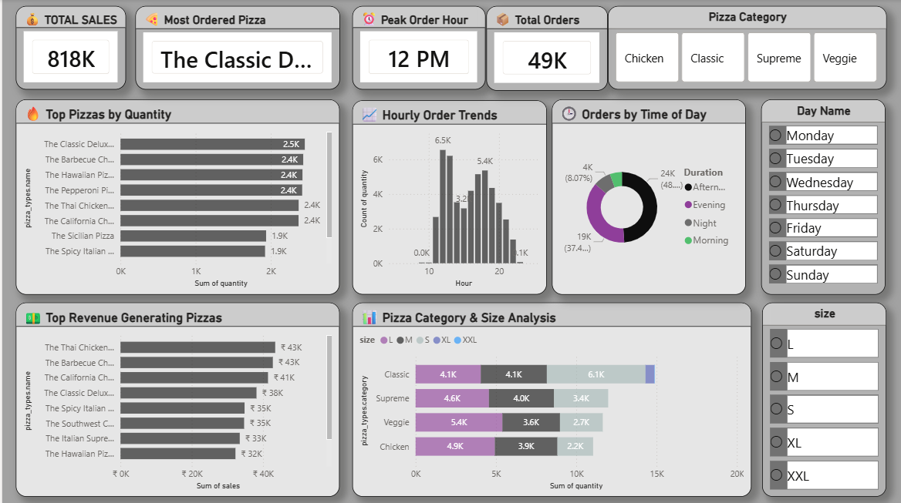

# pizza-sales-powerbi-dashboard

# 🍕 Pizza Sales Analytics Dashboard – Power BI

## 📌 Project Overview
This is my first Power BI project focused on analyzing pizza sales performance, customer ordering behavior, revenue trends, and peak ordering times using interactive visualizations and KPIs.

The dashboard helps identify:
- Peak ordering hours
- Top-selling pizzas
- Revenue-generating pizzas
- Customer ordering patterns
- Sales distribution by pizza category and size

---

## 📊 Dashboard Preview

---

## 🚀 Key Insights
- ⏰ Peak pizza orders occur around **12 PM**
- 🍕 The **Classic Deluxe Pizza** is the most ordered pizza
- 💰 Total sales reached **₹818K**
- 📦 Total orders exceeded **49K**
- 🌅 Afternoon contributes the highest number of orders
- 📊 Classic category dominates quantity sales

---

## 📈 Dashboard Features
### KPI Cards
- Total Sales
- Most Ordered Pizza
- Peak Order Hour
- Total Orders

### Interactive Visuals
- Top Pizzas by Quantity
- Revenue Generating Pizzas
- Hourly Order Trends
- Orders by Time of Day
- Pizza Category & Size Analysis

### Interactive Slicers
- Pizza Category
- Day Name
- Pizza Size

---

## 🛠 Tools & Technologies Used
- Power BI
- Power Query
- DAX
- Data Modeling

---

## 📂 Dataset Information
The project uses 4 datasets:
- `orders.csv`
- `order_details.csv`
- `pizzas.csv`
- `pizza_types.csv`

Key columns used:
- Order ID
- Date & Time
- Pizza Name
- Pizza Category
- Pizza Size
- Quantity
- Price

---

## 🧠 DAX Measures Used
Some important measures created in this project:
- Total Sales
- Total Orders
- Peak Order Hour
- Top Revenue Generating Pizza
- Most Ordered Pizza

---

## 📚 What I Learned
Through this project, I learned:
- Data Cleaning using Power Query
- Creating relationships between tables
- Building DAX measures
- Designing interactive dashboards
- Using KPI cards and slicers
- Data visualization best practices

---

## 🎯 Project Goal
The main goal of this project was to practice Power BI fundamentals and transform raw sales data into meaningful business insights through an interactive dashboard.

---

## 🔗 Connect With Me
Feel free to connect with me on LinkedIn and check out more upcoming projects!

#PowerBI #DataAnalytics #Dashboard #BusinessIntelligence #DataVisualization
